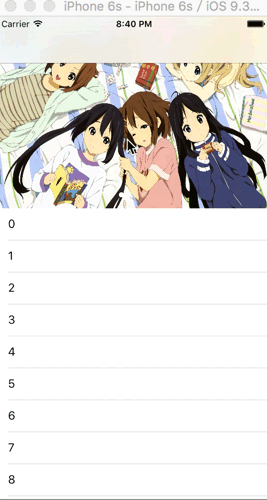

# ALCircleScrollView
一个无线循环的轮播器，支持自定义视图

## 示例

## 使用

```objective-c
//初始化
self.circleView = [[ALCircleScrollView alloc] initWithFrame:CGRectMake(0, 0, self.view.frame.size.width, 200)];
//设置委托
self.circleView.delegate = self;
//载入数据
[self.circleView reloadData];
```

### ALCircleScrollViewDelegate

```objective-c
//轮播视图的数目
- (NSUInteger)numberOfViewsInScrollView:(UIScrollView *)scrollView;
//自定义轮播中的视图
- (UIView *)scrollView:(UIScrollView *)scrollView viewAtIndex:(NSUInteger)index;
//点击视图时的回调
@optional
- (void)scrollView:(UIScrollView *)scrollView didSelectedAtIndex:(NSUInteger)index;
```
